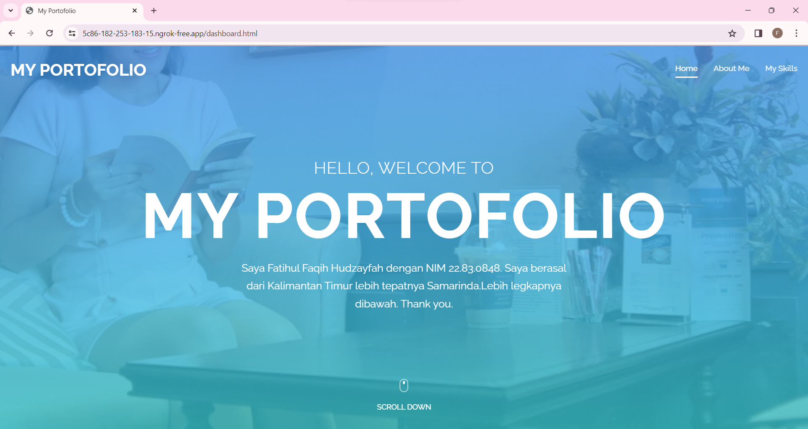
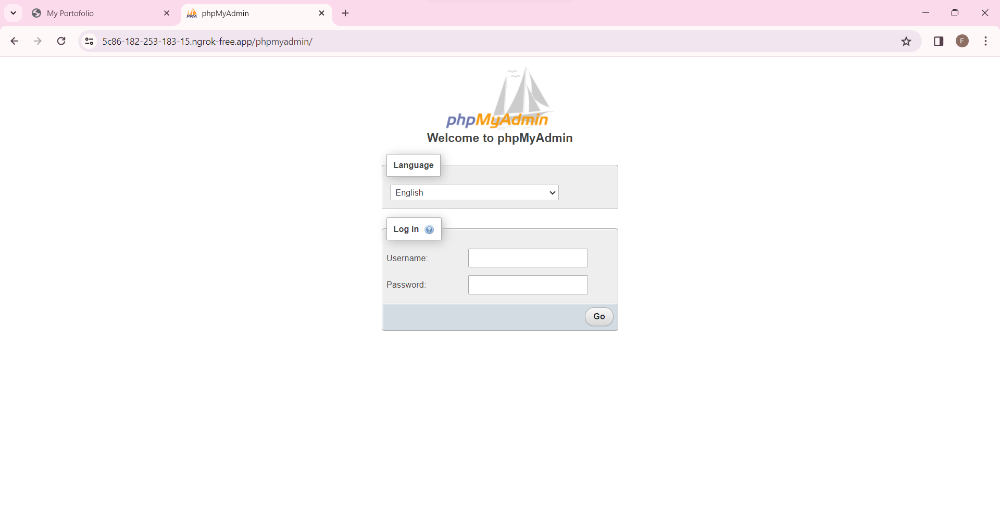
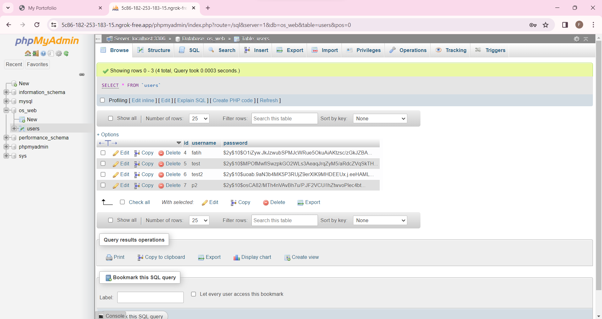
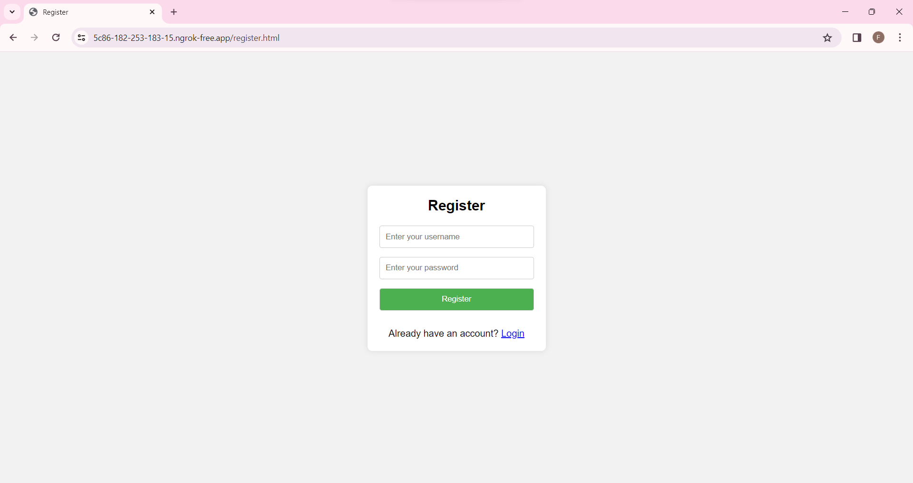

# Nama : Fatihul Faqih Hudzayfah
## _NIM : 22.83.0848_

## Web Server

- SSH
- Apache2
- MySQL
- Ngrok
- Password Encrypt



## Apache2

Update dan upgrade terlebih dahulu.
```sh
sudo apt-get update
```

Install apache2.
```sh
sudo apt-get install apache2
```

> Tes buka di browser dengan ip.

Setelah itu, Konfigurasi firewall.
```sh
sudo ufw app list
```
Output:

>Available applications:
  Apache
  Apache Full
  Apache Secure
>  OpenSSH

Izinkan Port 80:
```sh
sudo ufw allow 'Apache'
```

Output:

>Rules updated
>Rules updated (v6)

Untuk melihat status
```sh
sudo ufw status
```
>note: jika inactive, maka perlu diaktifkan dengan berikut

Untuk melihat status
```sh
sudo ufw enable
sudo ufw status
```


## MySQL

Instal MySQL dan tool lainnya
```sh
sudo apt install php libapache2-mod-php php-mysql mysql-serve
```

Jika ingin mengubah authenticate root
```sh
sudo mysql
```
Isi seperti ini:
>mysql> ALTER USER 'root'@'localhost' IDENTIFIED WITH caching_sha2_password BY 'Password123#@!';

Lalu 
```sh
mysql -u root -p
```



## Ngrok

>Buka browser dan login ngrok

install ngrok
```sh
apt-get install ngrok
```

## Password Encrypt

>Pada file php edit hash

Seperti ini:
```sh
$password = password_hash($_POST["password"], PASSWORD_DEFAULT);
```




## Hasil Web



## Database


